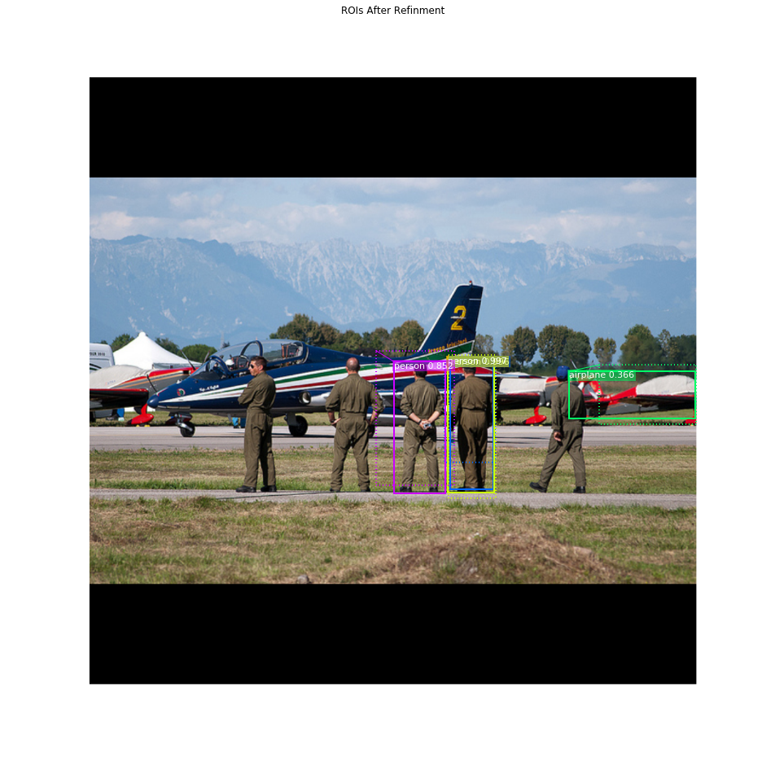

# PyTorch version of MASK-RCNN

### Download the pretrained model at [Dropbox](uploading)
 
## INSTALLATION
### CUDA CODE:
Build NMS and ROIAlign/CropAndResize
```
cd lib
./make.sh
```

### MS COCO Requirements:
Install `pycocotools` from forks of the original pycocotools with fixes for Python3 and Windows (the official repo doesn't seem to be active anymore).
* Linux: https://github.com/waleedka/coco
* Windows: https://github.com/philferriere/cocoapi.

To train or test on MS COCO, you'll also need:
* pycocotools (installation instructions below)
* [MS COCO Dataset](http://cocodataset.org/#home)
* Download the 5K [minival](https://dl.dropboxusercontent.com/s/o43o90bna78omob/instances_minival2014.json.zip?dl=0)
  and the 35K [validation-minus-minival](https://dl.dropboxusercontent.com/s/s3tw5zcg7395368/instances_valminusminival2014.json.zip?dl=0)
  subsets. More details in the original [Faster R-CNN implementation](https://github.com/rbgirshick/py-faster-rcnn/blob/master/data/README.md). 
  
## Structure of the code
* `./network`: This package contains all the definitions for the mask rcnn.

* `./preprocess`: This package contains all the scripts for the data pipeline: Transform raw image and labels.

* `./postprocess`: This package contains all the scripts for the model's output...

* `./tnn`: This is the training framework submodule. This code shouldn't be modified directly from this project in order to avoid dependency issues

* `./models`: This directory contain the dilated weights trained on MS-COCO

* `./README`: This package contains image will showed on the Gitlab.

## Demo
Change the path of the model at `demo.py`, and then run:
```
python demo.py
```

## Training
Change the path of the trained model and model save path at `train.py`, and then run:
```
python train.py
```

## Evaluation
Change the path of the model at `eval.py`, and then run:
```
python eval.py
```
### mAP of Bbox on person:


### mAP of Segmentation on person:


## Pipeline Description
### Overview:


### Stage 0, Resnet101 and Feature Pyramid Network to Extrac Features of the Image:


### Stage 1, Region Proposal Network:


The Region Proposal Network (RPN) runs a lightweight binary classifier on a lot of boxes (anchors) over the image and returns object/no-object scores. Anchors with high *objectness* score (positive anchors) are passed to the stage two to be classified.

Often, even positive anchors don't cover objects fully. So the RPN also regresses a refinement (a delta in location and size) to be applied to the anchros to shift it and resize it a bit to the correct boundaries of the object.

#### 1.1 RPN Targets:

The RPN targets are the training values for the RPN. To generate the targets, we start with a grid of anchors that cover the full image at different scales, and then we compute the IoU of the anchors with ground truth object. Positive anchors are those that have an IoU >= 0.7 with any ground truth object, and negative anchors are those that don't cover any object by more than 0.3 IoU. Anchors in between (i.e. cover an object by IoU >= 0.3 but < 0.7) are considered neutral and excluded from training.

To train the RPN regressor, we also compute the shift and resizing needed to make the anchor cover the ground truth object completely.

#### 1.2 RPN Predictions:


#### 1.3 RoIAlign


### Stage 2, Proposal Classification:
This stage takes the region proposals from the RPN and classifies them.

### 2.1 Proposal Classification
Run the classifier heads on proposals to generate class propbabilities and bounding box regressions.

### 2.2  Detection


#### Apply Bounding Box Refinement
ROIs After Refinment



#### Filter Low Confidence Detections
Remove low confidence detections

#### Per-Class Non-Max Suppression
Detections after NMS


### 2.2 Bounding Box Refinement
This is an example of final detection boxes (dotted lines) and the refinement applied to them (solid lines) in the second stage.


## Stage 3: Generating Masks
This stage takes the detections (refined bounding boxes and class IDs) from the previous layer and runs the mask head to generate segmentation masks for every instance.


### 4. Composing the different pieces into a final result


