# PyTorch has no [tf.crop_and_resize](https://www.tensorflow.org/api_docs/python/tf/image/crop_and_resize) function used for feature pyramid network, Million thanks to [longwc](https://github.com/longcw/RoIAlign.pytorch) ported it from tensorflow!
# Notice: We have no time to continue this project, the model is converted and performing well; The data pipeline is 95% complete, for the training you may study well for the loss function. :)

### Download the [tf+keras model](https://github.com/matterport/Mask_RCNN/releases) and run `python convert_weights/convert_weights.py` or download the converted model at [Dropbox](https://www.dropbox.com/s/6ccfqkc8rsiqsqe/mrcnn.pth?dl=0).
 
## INSTALLATION
### CUDA CODE:
Build NMS and [ROIAlign/CropAndResize](https://github.com/longcw/RoIAlign.pytorch)
+ Changing `-arch` in `lib/make.sh` for your GPU
    ```
    # Which CUDA capabilities do we want to pre-build for?
    # https://developer.nvidia.com/cuda-gpus
    # Compute/shader model   Cards
    # 6.1                    P4, P40, Titan Xp, GTX 1080 Ti, GTX 1080
    # 6.0                    P100
    # 5.2                    M40, Titan X, GTX 980
    # 3.7                    K80
    # 3.5                    K40, K20
    # 3.0                    K10, Grid K520 (AWS G2)
    ```
```
cd lib
./make.sh
```

### MS COCO Requirements:
Install `pycocotools` from forks of the original pycocotools with fixes for Python3 and Windows (the official repo doesn't seem to be active anymore).
* Linux: https://github.com/waleedka/coco
* Windows: https://github.com/philferriere/cocoapi.

To train or test on MS COCO, you'll also need:
* pycocotools (installation instructions below)
* [MS COCO Dataset](http://cocodataset.org/#home)
* Download the 5K [minival](https://dl.dropboxusercontent.com/s/o43o90bna78omob/instances_minival2014.json.zip?dl=0)
  and the 35K [validation-minus-minival](https://dl.dropboxusercontent.com/s/s3tw5zcg7395368/instances_valminusminival2014.json.zip?dl=0)
  subsets. More details in the original [Faster R-CNN implementation](https://github.com/rbgirshick/py-faster-rcnn/blob/master/data/README.md). 
  
## Structure 

* `./convert_weights`: How to convert the weights from [tf+keras version of MASK-RCNN](https://github.com/matterport/Mask_RCNN).

* `./network`: The definitions for the mask rcnn.

* `./preprocess`: All the scripts for the data pipeline: Transform raw image and labels.

* `./postprocess`: For the model's output...

* `./README`: This package contains image will showed on the Github.

## Demo
### Picture demo
Change the path of the model at `demo.py`, and then run:
```
python demo.py
```
Result:
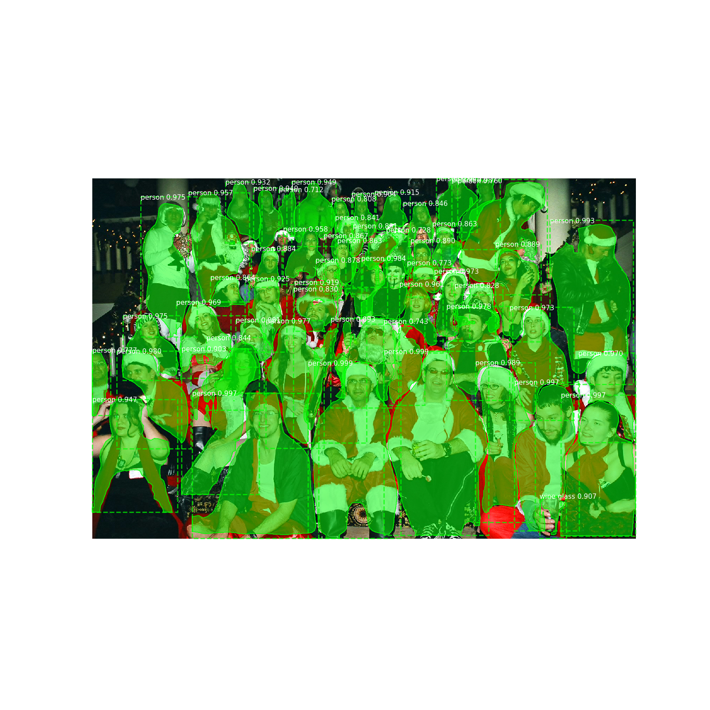

### Realtime webcam demo
Change the path of the model at `realtime_demo.py`, and then run:
```
python realtime_demo.py
```

## Evaluation
Change the path of the model at `eval.py`, and then run:
```
python eval.py
```
### mAP of Bbox, [tf+keras model](https://github.com/matterport/Mask_RCNN/releases) has 0.347, the difference may come from some [upsample function](https://github.com/matterport/Mask_RCNN/issues/37), or other issues which would be great if you want to dive deep:

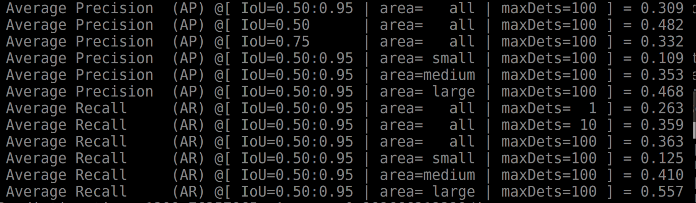

### mAP of Segmentation [tf+keras model](https://github.com/matterport/Mask_RCNN/releases) has 0.296, the difference may come from some [upsample function](https://github.com/matterport/Mask_RCNN/issues/37), or other issues which would be great if you want to dive deep:

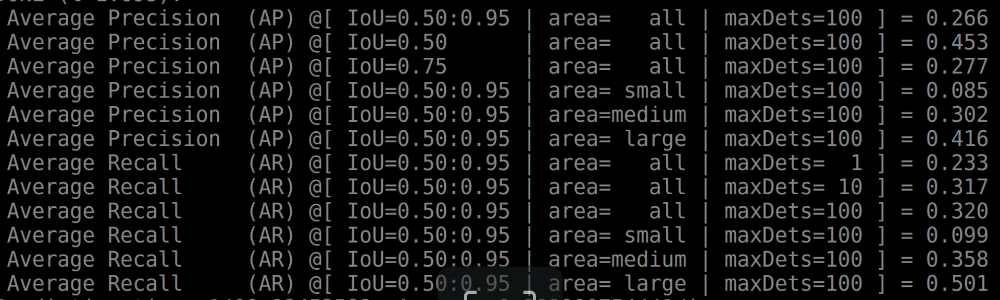

## Training(Not woring for now)...
### Test data loader
`python preprocess/test_data_loader`
Loss function is at `network/mask_rcnn.py`, you may need study well for the loss function in the [keras code](https://github.com/matterport/Mask_RCNN) and modify it at `network/mask_rcnn.py`.

## Pipeline Description
### Overview:

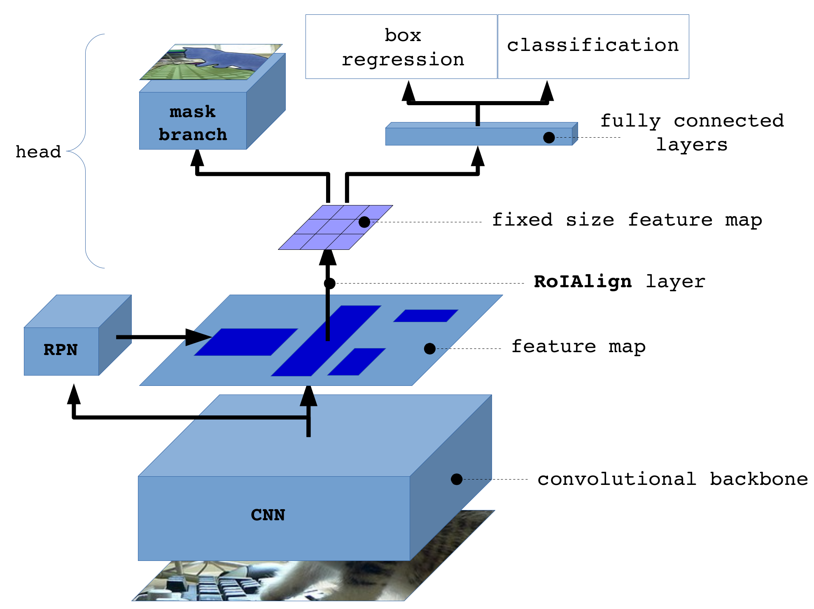

### Stage 0, Resnet101 and Feature Pyramid Network to Extrac Features of the Image:

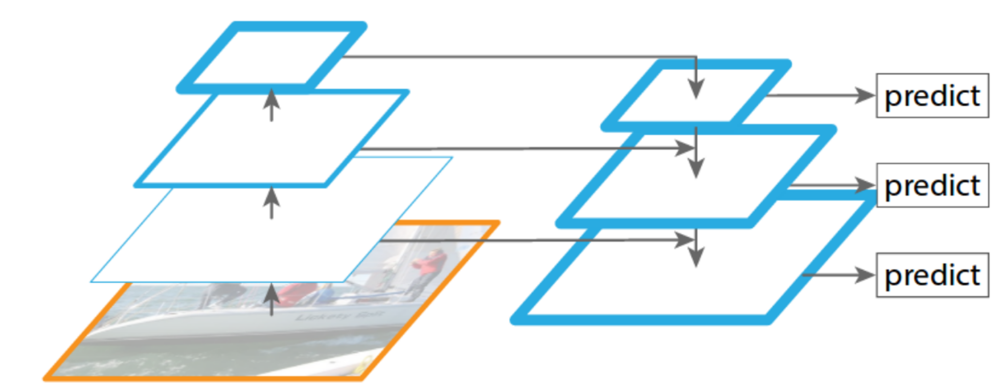

### Stage 1, Region Proposal Network:

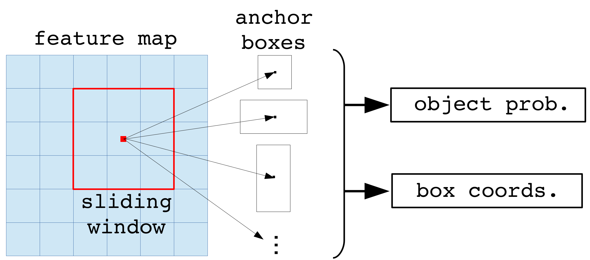

The Region Proposal Network (RPN) runs a lightweight binary classifier on a lot of boxes (anchors) over the image and returns object/no-object scores. Anchors with high *objectness* score (positive anchors) are passed to the stage two to be classified.

Often, even positive anchors don't cover objects fully. So the RPN also regresses a refinement (a delta in location and size) to be applied to the anchros to shift it and resize it a bit to the correct boundaries of the object.

#### 1.1 RPN Targets:

The RPN targets are the training values for the RPN. To generate the targets, we start with a grid of anchors that cover the full image at different scales, and then we compute the IoU of the anchors with ground truth object. Positive anchors are those that have an IoU >= 0.7 with any ground truth object, and negative anchors are those that don't cover any object by more than 0.3 IoU. Anchors in between (i.e. cover an object by IoU >= 0.3 but < 0.7) are considered neutral and excluded from training.

To train the RPN regressor, we also compute the shift and resizing needed to make the anchor cover the ground truth object completely.

#### 1.2 RPN Predictions:

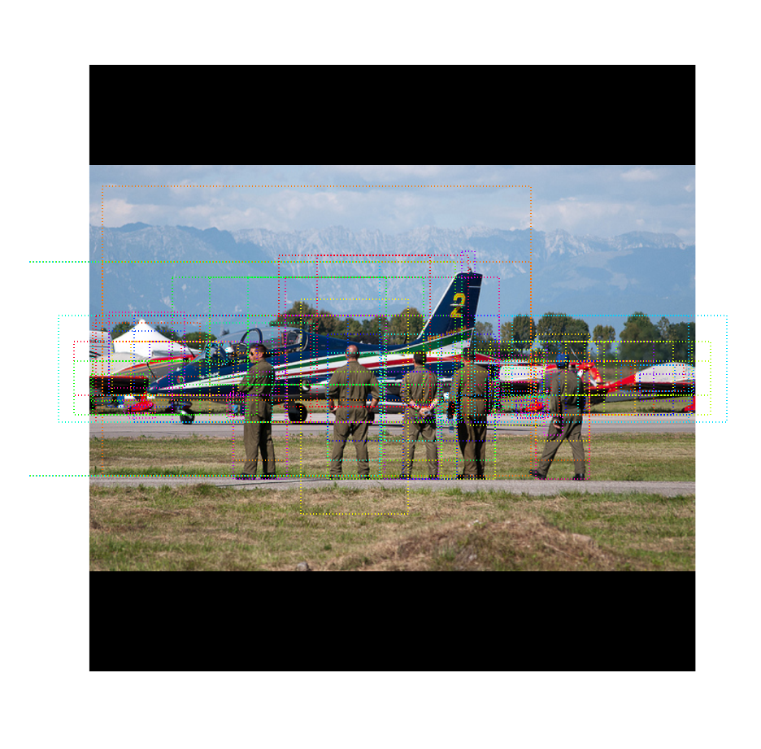

#### 1.3 RoIAlign

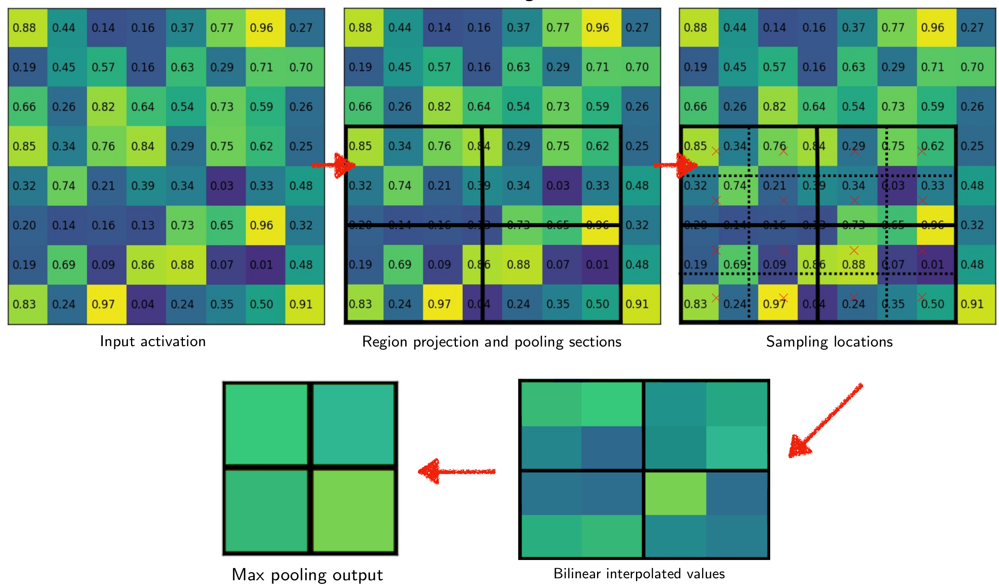

### Stage 2, Proposal Classification:
This stage takes the region proposals from the RPN and feed the result to detection and mask branch respectively.

### 2.2  Detection

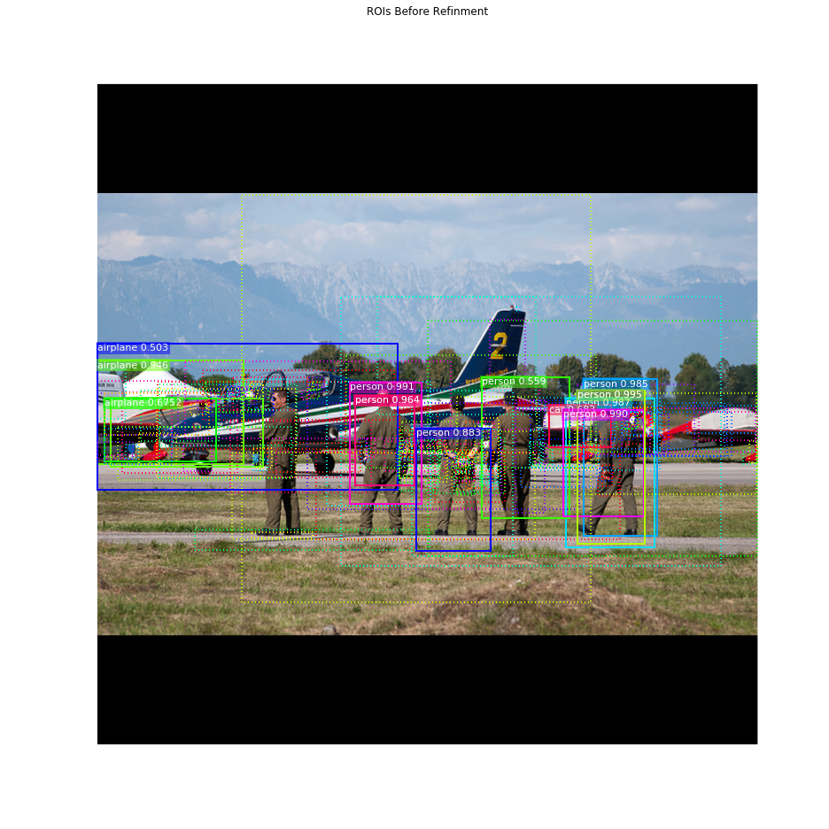

#### Per-Class Non-Max Suppression
Detections after NMS

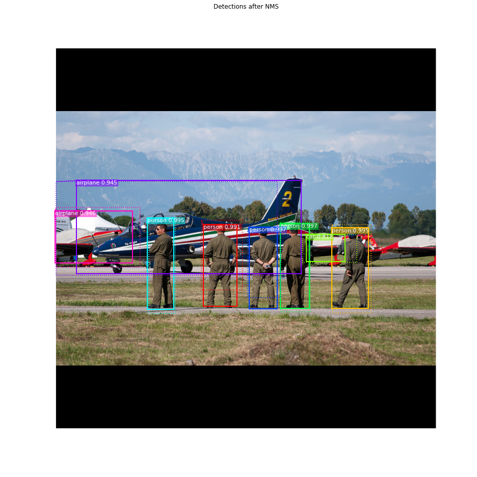

### 2.2 Bounding Box Refinement
This is an example of final detection boxes (dotted lines) and the refinement applied to them (solid lines) in the second stage.

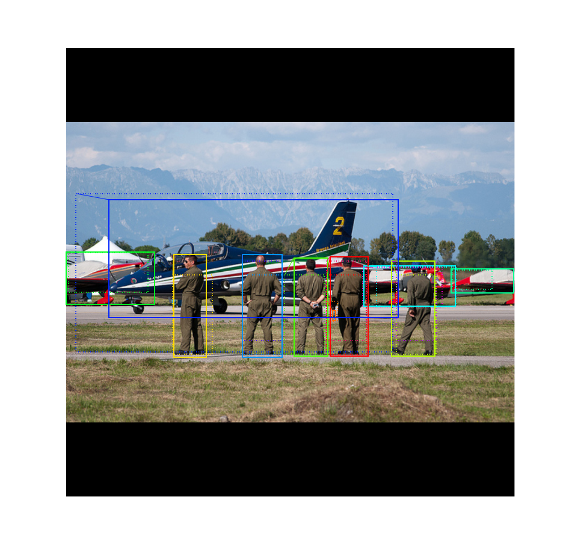

## Stage 3: Generating Masks
This stage takes the detections (refined bounding boxes and class IDs) from the previous layer and runs the mask head to generate segmentation masks for every instance.


### 4. Composing the different pieces into a final result


